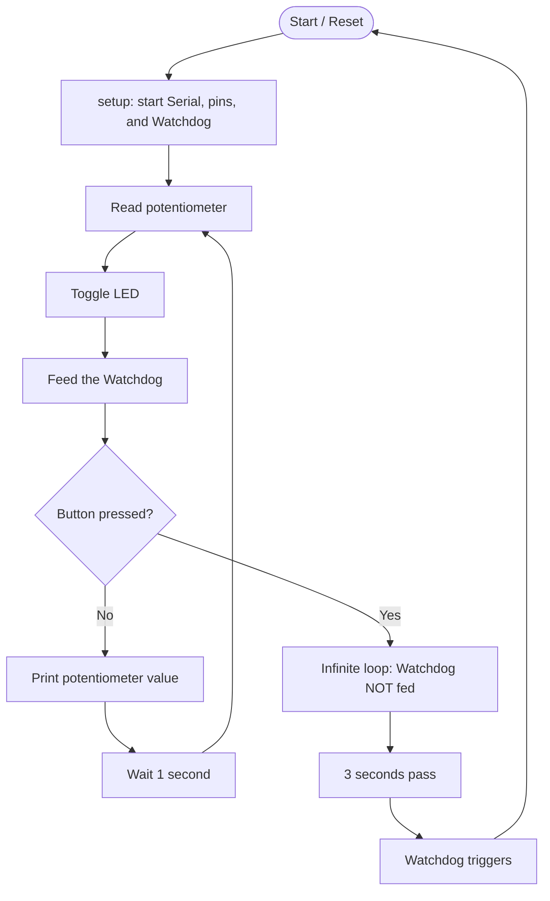

<div align="center">

# ⏱️ ESP32 Watchdog Timer Demo

**A beginner-friendly IoT project showing how a Watchdog Timer rescues an ESP32 from freezing**


</div>

---

> 🧪 **Simulation based project:** No physical board is needed. Everything runs in the **Wokwi simulator**. The same code can also be used on a real ESP32 (see [Using This on Real Hardware](#-using-this-on-real-hardware)).

---

## 📑 Table of Contents

- [What is a Watchdog Timer?](#-what-is-a-watchdog-timer)
- [What This Project Does](#-what-this-project-does)
- [Components Used](#-components-used)
- [How It Works](#-how-it-works)
- [Code Explanation](#-code-explanation)
- [Project Structure](#-project-structure)
- [How to Run the Simulation](#-how-to-run-the-simulation)
- [Expected Output](#-expected-output)
- [Try It Yourself](#-try-it-yourself)
- [Using This on Real Hardware](#-using-this-on-real-hardware)
- [Core Version Note](#-core-version-note)
- [What I Learned](#-what-i-learned)
- [Author](#-author)
- [License](#-license)

---

## 🐕 What is a Watchdog Timer?

Imagine a guard dog that expects you to pet it every 3 seconds. If you forget, the dog barks and wakes everyone up.

A **Watchdog Timer (WDT)** works the same way:

1. The program must **"feed"** (reset) the watchdog regularly.
2. If the program gets stuck and stops feeding it, the timer runs out.
3. The ESP32 then **restarts automatically**, so the device recovers by itself.

> 💡 This is very important for IoT devices that run for months with nobody nearby to press the reset button.

---

## 🎯 What This Project Does

| Situation | What happens |
|-----------|--------------|
| ✅ Normal operation | LED blinks every second and the potentiometer value (0 to 100%) prints to the Serial Monitor. The watchdog is fed every loop. |
| ⚠️ Button pressed (fault injection) | The program enters an infinite loop and **stops feeding** the watchdog. |
| 🔄 After 3 seconds | The watchdog triggers and the ESP32 **resets**, then starts again from `setup()`. |

The button is used to *simulate a software crash* so you can watch the watchdog rescue the system.

---

## 🔧 Components Used

| Component | ESP32 Pin | Purpose |
|-----------|:---------:|---------|
| 🎛️ Potentiometer | `GPIO 35` | Gives a changing analog value to read |
| 🔘 Push button | `GPIO 25` | Injects the fault (button to GND, uses internal pull-up) |
| 💡 LED | `GPIO 4` | Blinks to show the program is running |

Pins and timeout are defined at the top of `main.cpp`:

```cpp
#define WDT_TIMEOUT 3   // Watchdog timeout in seconds
#define POT_PIN    35
#define BUTTON_PIN 25
#define LED         4
```

---

## ⚙️ How It Works



---

## 📖 Code Explanation

<details>
<summary><b>Click to see the step-by-step explanation</b></summary>

### In `setup()`
1. Start the Serial Monitor at `115200` baud.
2. Set the button as `INPUT_PULLUP` and the LED as `OUTPUT`.
3. Start the watchdog with a 3-second timeout:
```cpp
   esp_task_wdt_init(WDT_TIMEOUT, true);
```
   The `true` means "restart the ESP32 if the timeout happens".
4. Add the current task to the watchdog list:
```cpp
   esp_task_wdt_add(NULL);
```

### In `loop()`
1. Read the potentiometer and convert it to a 0 to 100 value.
2. Toggle the LED.
3. Feed the watchdog with `esp_task_wdt_reset();`
4. If the button is pressed (`LOW`), run `while (true) {}` forever. The watchdog is no longer fed, so it restarts the board after 3 seconds.
5. Otherwise, print the potentiometer value and wait 1 second.

</details>

---

## 📁 Project Structure

```text
Task1/
├── src/              # main.cpp (the program)
├── include/          # header files
├── lib/              # extra libraries
├── test/             # tests
├── diagram.json      # Wokwi circuit diagram
├── wokwi.toml        # Wokwi configuration
├── platformio.ini    # PlatformIO settings
└── .gitignore        # files Git should skip
```

---

## 🚀 How to Run the Simulation

### Requirements

- [Visual Studio Code](https://code.visualstudio.com/)
- [PlatformIO extension](https://platformio.org/install/ide?install=vscode)
- [Wokwi for VS Code extension](https://marketplace.visualstudio.com/items?itemName=wokwi.wokwi-vscode) (a free Wokwi license is required)

### Steps

1. **Clone** this repository:
```bash
   git clone <your-repo-link>
```
2. **Open** the project folder in VS Code.
3. **Build** the project with PlatformIO (click the ✔ icon at the bottom, or run `pio run`).
4. Press **F1**, then choose **Wokwi: Start Simulator**.
5. Open the **Serial Monitor** in the simulator to watch the output.

---

## 🖥️ Expected Output

**Normal running:**

```text
--- ESP32 Watchdog Timer Demo ---
System Initialized. Watchdog Timer Enabled.
Potentiometer Value: 42
Potentiometer Value: 42
Potentiometer Value: 57
```

**After pressing the button:**

```text
FAULT INJECTED! Entering infinite blocking loop...
```

About 3 seconds later, the ESP32 restarts and the startup messages appear again.

<!-- Add your screenshots below. Put the images in a folder named "images" -->
<!--
### 📸 Screenshots


-->

---

## 🧩 Try It Yourself

- [ ] Run the simulation and turn the potentiometer. Watch the value change.
- [ ] Press and hold the button. See the fault message, then the automatic restart.
- [ ] Change `WDT_TIMEOUT` to `5` and see how the restart time changes.
- [ ] Remove `esp_task_wdt_reset();` and watch the board keep restarting by itself.

---

## 🔌 Using This on Real Hardware

If you want to build this with a real ESP32:

| Part | Connection |
|------|------------|
| Potentiometer | Middle pin to `GPIO 35`, outer pins to `3.3V` and `GND` |
| Push button | Between `GPIO 25` and `GND` |
| LED | `GPIO 4` → 220 Ω resistor → LED → `GND` |

Then:

1. Connect the ESP32 to your computer with a USB cable.
2. Upload the code with PlatformIO (**Upload** button, or `pio run -t upload`).
3. Open the Serial Monitor at **115200 baud**.

> ⚠️ Use **3.3V**, not 5V, for the potentiometer. ESP32 pins are not 5V tolerant.

---

## 🧱 Core Version Note

This project uses the older watchdog function, which works with **Arduino-ESP32 core 2.x**:

```cpp
esp_task_wdt_init(WDT_TIMEOUT, true);
```

Newer versions (**core 3.x**) use a config structure instead:

```cpp
esp_task_wdt_config_t twdt_config = {
    .timeout_ms = WDT_TIMEOUT * 1000,
    .idle_core_mask = (1 << portNUM_PROCESSORS) - 1,
    .trigger_panic = true
};
esp_task_wdt_init(&twdt_config);
```

If you get an error about `esp_task_wdt_init`, check which core version your `platformio.ini` uses.

---

## 🎓 What I Learned

- What a watchdog timer is and why IoT devices need one
- How to start, add a task to, and feed the ESP32 task watchdog
- How to simulate a fault and watch the system recover
- How to build and test an ESP32 project in a simulator

---

## 👤 Author

HASSAAN-UL-HAQ TABASSUM, Computer Engineering student at NUST CEME
CE-46, 5th Semester | Internet of Things Lab 

---

## 📄 License

This project is for learning purposes. Feel free to use and modify it.

<div align="center">

⭐ If this helped you, consider giving the repo a star!

</div>
